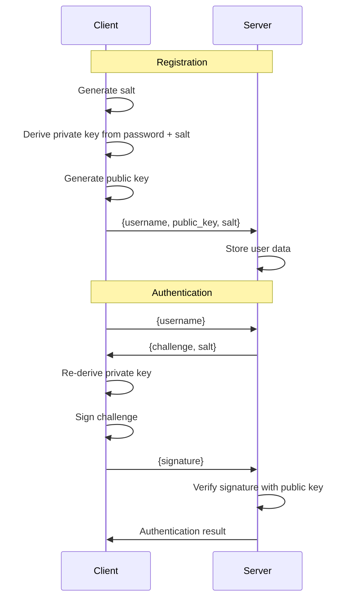

# 🔐 PDSA Authentication Demo

**Password-Derived Signature Authentication** - A secure alternative to traditional password authentication that never exposes passwords to servers.

## 🌟 What is PDSA?

PDSA (Password-Derived Signature Authentication) is a novel authentication approach that combines the familiarity of passwords with the security of digital signatures. Instead of sending passwords to servers, users derive cryptographic key pairs from their passwords and use digital signatures for authentication.

### Key Benefits

- **🛡️ No Password Exposure**: Passwords never leave the client device in plaintext
- **🔒 Server Compromise Protection**: Even if the server is breached, attackers cannot impersonate users
- **🔄 Automatic Key Rotation**: Changing passwords naturally generates new key pairs
- **🚫 No Cross-Service Linkability**: Each service gets unique keys due to unique salts
- **⚡ Simple Implementation**: Much simpler than complex protocols like SRP or OPAQUE

## 🏗️ Architecture

### Authentication Flow



### Security Properties

- **Password Derivation**: PBKDF2
- **Digital Signatures**: ECDSA with secp256k1 curve
- **Challenge-Response**: Prevents replay attacks
- **Unique Salts**: Prevents rainbow table attacks

## 🚀 Quick Start

### Prerequisites

- Python 3.7+
- Modern web browser
- Internet connection (for loading crypto library)

### Installation

1. **Clone the repository**
   ```bash
   git clone https://github.com/danieltanfh95/pdsa.git
   cd pdsa
   ```

2. **Install Python dependencies**
   ```bash
   poetry update
   ```

3. **Run the server**
   ```bash
   python server.py
   ```

4. **Open your browser**
   ```
   http://localhost:8000
   # or 
   python client.py
   ```

## 📁 Project Structure

```
pdsa-demo/
├── README.md              # This file
├── server.py             # FastAPI backend server
├── client.py             # Python client example
├── common.py             # Shared cryptographic functions
├── users.db              # SQLite database (auto-created)
├── static/
│   └── index.html        # Frontend web application
└── requirements.txt      # Python dependencies (optional)
```

## 🖥️ Server API

### Endpoints

#### `POST /api/register`
Register a new user with their public key and salt.

**Request:**
```json
{
  "username": "alice",
  "public_key": "base64-encoded-der-public-key",
  "salt": "base64-encoded-salt"
}
```

**Response:**
```json
{
  "message": "User registered successfully"
}
```

#### `POST /api/login`
Initiate login by requesting a challenge.

**Request:**
```json
{
  "username": "alice"
}
```

**Response:**
```json
{
  "challenge": "timestamp:random-data",
  "salt": "base64-encoded-salt",
  "expires_in": 300
}
```

#### `POST /api/authenticate`
Complete authentication by providing signature.

**Request:**
```json
{
  "username": "alice",
  "signature": "base64-encoded-signature"
}
```

**Response:**
```json
{
  "message": "Authentication successful",
  "username": "alice",
  "authenticated": true
}
```

## 🌐 Client Implementation

The project includes two client implementations:

### Web Client (JavaScript)
- **CryptoJS + Elliptic**: For PBKDF2 key derivation and ECDSA operations
- **Modern Web APIs**: Uses Web Crypto API and fetch for HTTP requests
- **DER Encoding**: Proper ASN.1 DER formatting for compatibility with server

### Python Client (client.py)
- **Cryptography Library**: Uses Python's cryptography package

### Key Functions

**JavaScript (Web Client):**
```javascript
// Derive deterministic key pair from password
await derivePrivateKey(password, salt)

// Sign authentication challenge  
keyPair.sign(challengeHash)

// Register new user
await register()

// Authenticate existing user
await login()
```

**Python (CLI Client):**
```python
# Shared crypto functions from common.py
from common import derive_private_key, generate_challenge

# Register and login functions
register("username", "password")
login("username", "password")
```

## 🔒 Security Considerations

### ✅ Security Features

- **Password Protection**: Passwords never transmitted or stored in plaintext
- **Salt Uniqueness**: Each user gets a cryptographically random salt
- **Challenge Freshness**: Challenges expire after 5 minutes
- **Signature Verification**: Server validates signatures using stored public keys
- **Replay Protection**: Each authentication uses a unique challenge

### ⚠️ Production Considerations

For production deployment, consider these enhancements:

1. **HTTPS Requirement**: Web Crypto API requires secure contexts
2. **Rate Limiting**: Prevent brute force attacks on authentication endpoints
3. **Session Management**: Implement JWT tokens or secure sessions
4. **Input Validation**: Add comprehensive input sanitization
5. **Database Security**: Use proper database credentials and connection pooling
6. **CORS Configuration**: Restrict allowed origins to your domain
7. **Monitoring**: Add logging and monitoring for security events

## 📊 Comparison with Other Methods

| Feature | Traditional Passwords | PDSA | SRP | OPAQUE |
|---------|----------------------|------|-----|---------|
| Server sees password | ❌ Yes | ✅ No | ✅ No | ✅ No |
| Implementation complexity | ✅ Simple | ✅ Simple | ❌ Complex | ❌ Very Complex |
| Mutual authentication | ❌ No | ❌ No | ✅ Yes | ✅ Yes |
| Server compromise protection | ❌ No | ✅ Yes | ✅ Yes | ✅ Yes |
| Standards compliance | ✅ Widely adopted | ❌ Novel approach | ✅ RFC standard | ✅ IRTF draft |
| Browser compatibility | ✅ Universal | ✅ Modern browsers | ❌ Requires libraries | ❌ Limited support |

## 📄 License

This project is licensed under the MIT License - see the [LICENSE](license.md) file for details.

---

**⚠️ Disclaimer**: This is a proof-of-concept implementation. While the cryptographic principles are sound, this code has not undergone formal security auditing. Use in production environments at your own risk and consider professional security review.
